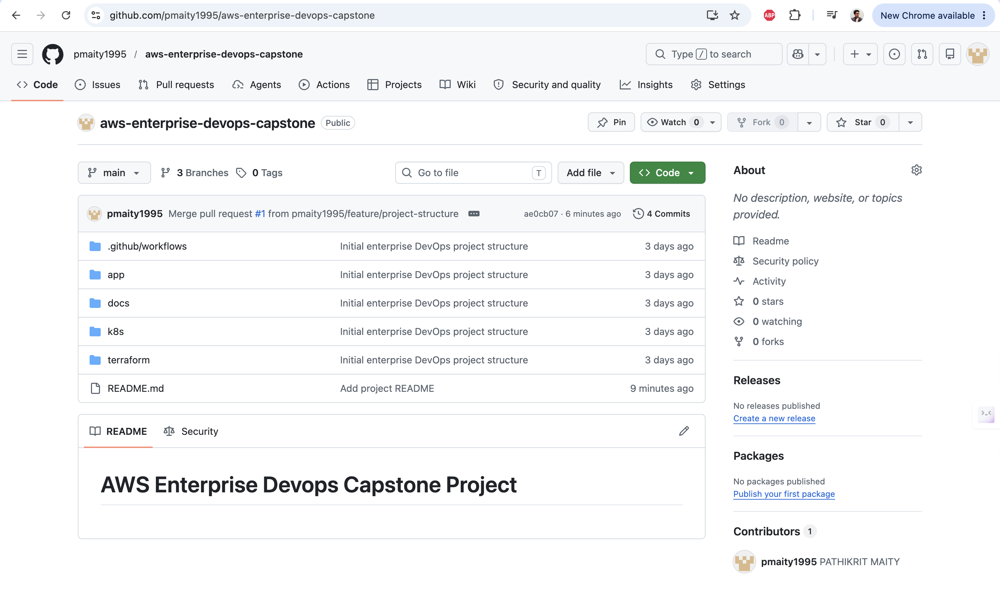
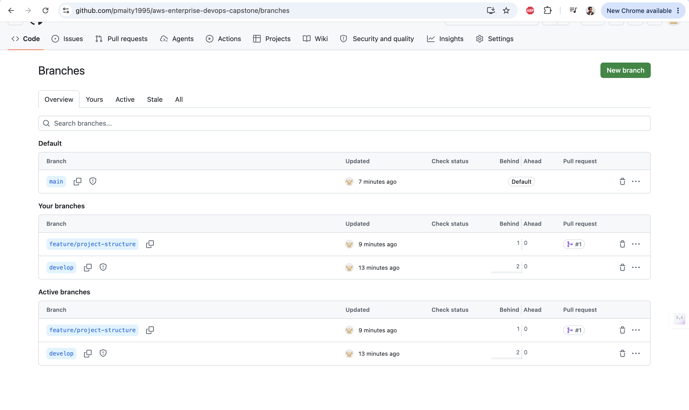
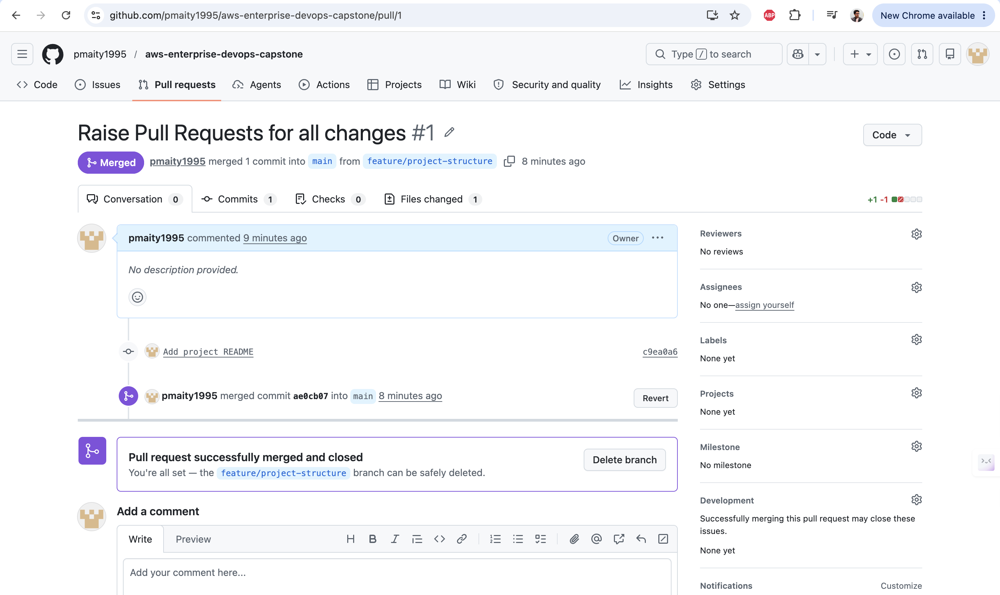
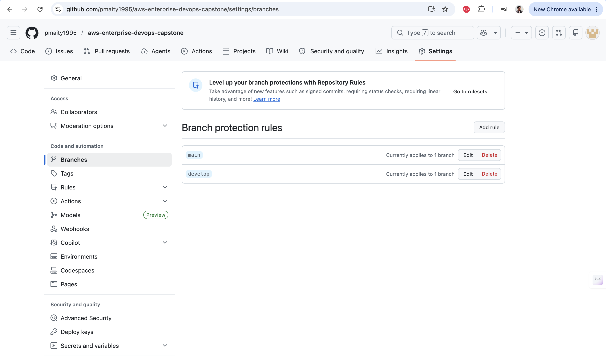

# Phase 1 – Source Control & Collaboration

## Objectives Completed

- Created GitHub Repository
- Implemented Branching Strategy
- Created feature branch
- Raised Pull Request
- Performed Code Review
- Merged PR into develop
- Enabled Branch Protection Rules

## Branch Strategy

- main → Production
- develop → Integration
- feature/* → Feature Development

## Evidence

### Repository Creation

### Branch Structure

### Pull Request

### Branch Protection

## Outcome

Phase 1 completed successfully.