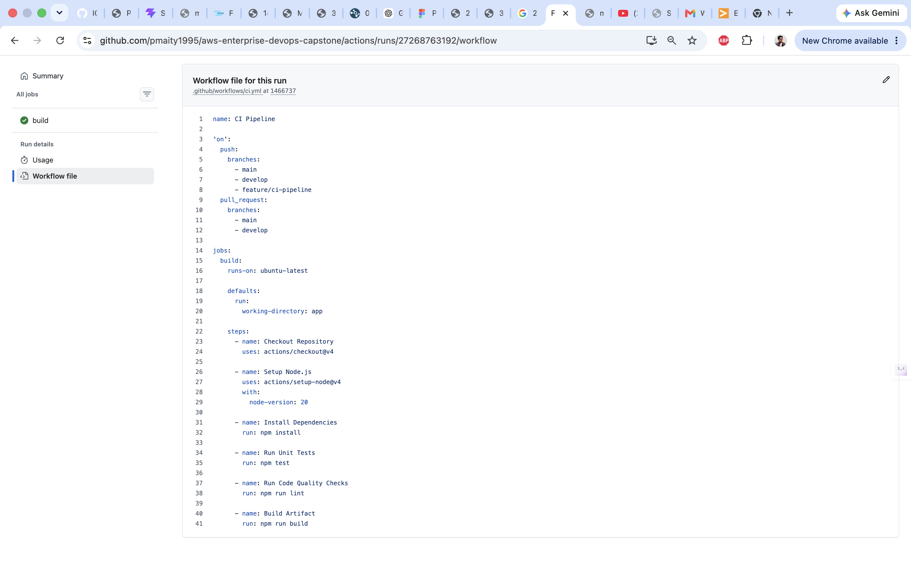
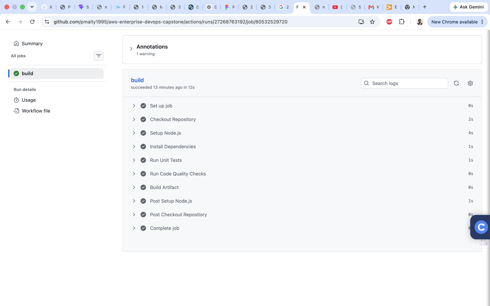
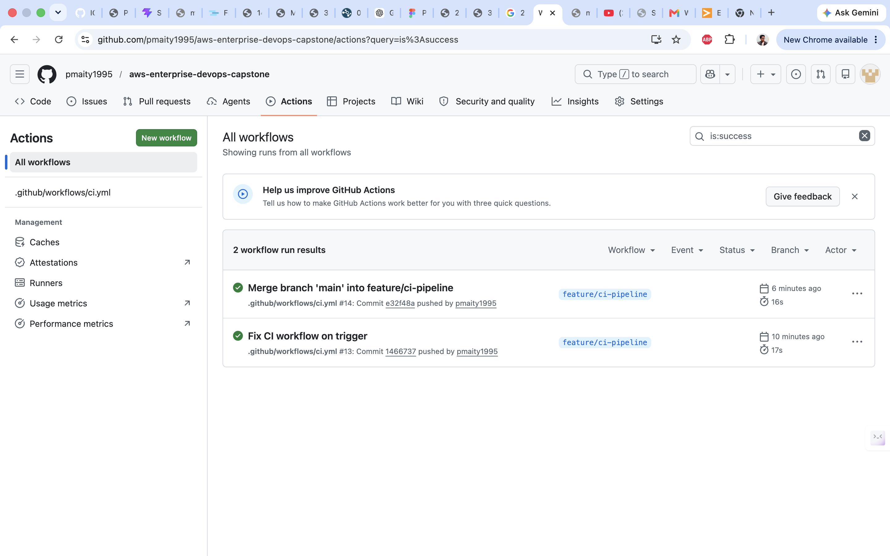

# Phase 2 – Continuous Integration (CI) Pipeline

## Objectives Completed

* Created GitHub Actions CI Workflow
* Configured Workflow Triggers
* Installed Project Dependencies
* Executed Automated Unit Tests
* Performed Code Quality Checks
* Generated Build Artifact
* Validated Successful Pipeline Execution

## CI Pipeline Stages

* Checkout Repository
* Setup Node.js Environment
* Install Dependencies
* Run Unit Tests
* Run Code Quality Checks
* Build Application

## Evidence

### Workflow Configuration

### Successful Build Execution

### GitHub Actions Success

## Outcome

Phase 2 completed successfully.
